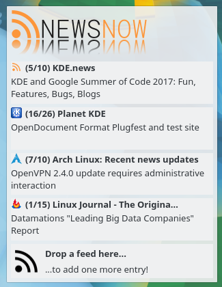
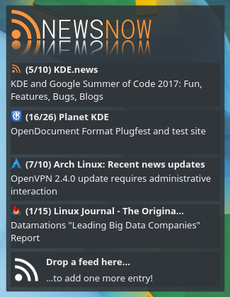

# NewsNOW

Plasma 5 applet for viewing RSS, Atom and other news feeds (successor of RSSNow).




## Installation

### Arch Linux
Package will be available soon...

### Source

#### Requirements
* [CMake 2.8.12+](https://cmake.org/) (Arch Linux package `cmake`)
* [Extra CMake Modules](http://api.kde.org/ecm/manual/ecm.7.html) (Arch Linux package `extra-cmake-modules`)
* [Qt 5.4+](https://www.qt.io/) (Arch Linux package `qt`)
* [KDE Frameworks 5.9+](https://api.kde.org/frameworks/) (Arch Linux package `kf5`)

#### Compile and install
```bash
git clone https://github.com/Misenko/newsnow-plasma5-applet.git
cd newsnow-plasma5-applet
mkdir build
cd build
cmake .. \
    -DCMAKE_INSTALL_PREFIX=/usr \
    -DCMAKE_BUILD_TYPE=Release \
    -DLIB_INSTALL_DIR=lib \
    -DKDE_INSTALL_USE_QT_SYS_PATHS=ON
make
sudo make install
```
NewsNOW is now available among your widgets and you can add it as usual.

## Contributing
1. Fork it ( https://github.com/Misenko/newsnow-plasma5-applet/fork )
2. Create your feature branch (`git checkout -b my-new-feature`)
3. Commit your changes (`git commit -am 'Add some feature'`)
4. Push to the branch (`git push origin my-new-feature`)
5. Create a new Pull Request
